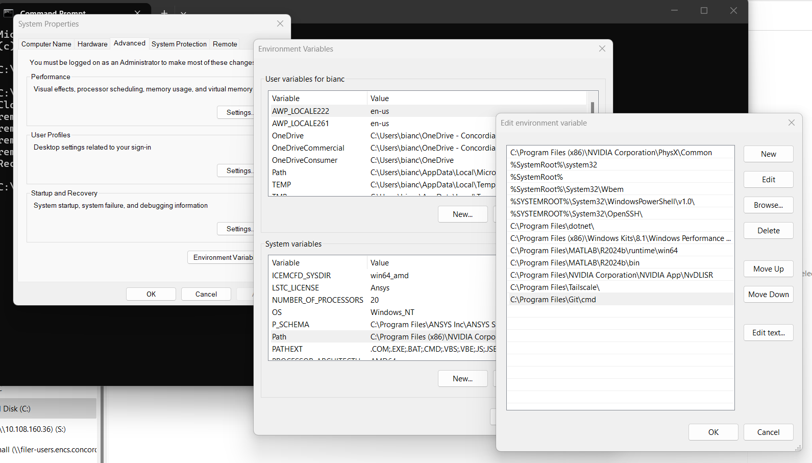

# Full-Car-Simulation

This repo contains the CFR27 full car model, run as a Python [uv](https://docs.astral.sh/uv/) simulation environment.

The instructions below are for **Windows** (PowerShell). Every contributor needs Git and uv installed, plus an SSH key registered with GitHub so pushing and pulling work without passwords.

## 1. Prerequisites

Install **Git** and **uv**:

```powershell
winget install --id Git.Git -e --source winget
winget install --id astral-sh.uv -e
```

Close and reopen your terminal afterwards so the new commands are on your `PATH`. Verify:

```powershell
git --version
uv --version
```

If git is not on your path do the following:
locate git.exe by default in:
C:\Program Files\Git\cmd.
Once path is located open enviroment variables and under system variables edit "path" 
add the git path there


## 2. Set up SSH keys for GitHub

This lets you `git push` and `git pull` without entering a password each time.

1. Generate a key (press Enter to accept the defaults):

   ```powershell
   ssh-keygen -t ed25519 -C "your_email@example.com"
   ```

2. Copy your **public** key to the clipboard:

   ```powershell
   Get-Content $env:USERPROFILE\.ssh\id_ed25519.pub | Set-Clipboard
   ```

3. Add it on GitHub: **Settings → SSH and GPG keys → New SSH key**, then paste.

4. Confirm it works:

   ```powershell
   ssh -T git@github.com
   ```

   You should see a message greeting you by your GitHub username.

## 3. Clone the repo (navitgate to the folder where you want this stored)

```powershell
git clone git@github.com:freeman803/Full-Car-Simulation.git
cd Full-Car-Simulation
```

## 4. Set up the Python environment with uv

From inside the repo, uv creates a virtual environment and installs the pinned dependencies:

```powershell / cmd
uv sync
```
Run simulation scripts through uv so they use that environment:

```powershell / cmd
uv run <script.py>
```

Add new dependencies as the model grows:

```powershell / cmd
uv add <package>
```

## 5. Everyday Git workflow

```powershell / cmd 
git pull                 # get the latest changes before you start
git add <files>          # stage your changes
git commit -m "message"  # commit them
git push                 # share them
```

## 6. Working on a branch

Create a branch for whatever you're working on, then open a pull request when it's ready.

**Branch naming convention:** `initials/project`

- `initials` — your initials
- `project` — a short description of the work (e.g. `suspensionModel`)

Example: `af/suspension-model`

```powershell / cmd
git switch -c rs/suspensionModel   # create and switch to a new branch called rs/suspensionModel
# ...make your changes, then...
git add <files>
git commit -m "message"
git push -u origin rs/suspensionModel   # push the branch the first time
```

After the first push, plain `git push` / `git pull` work on that branch. Some other handy commands:

```powershell / cmd
git branch                 # list your local branches
git switch main            # switch back to the main branch
git switch rs/suspension-model   # switch to an existing branch
git pull origin main       # pull the latest main into your branch to stay up to date
```

When the work is done, open a pull request on GitHub to merge your branch into `main`.
